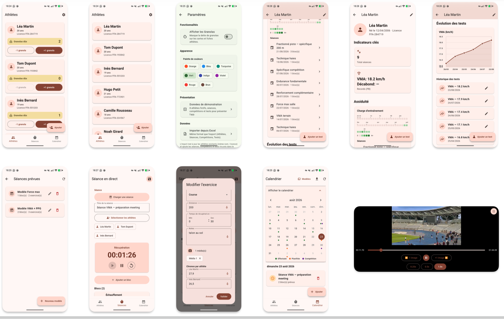

# TrackerField

Application Flutter locale (offline-first) destinée aux entraîneurs d'athlétisme.
Elle est conçue en priorité pour tablette Android en mode paysage, avec une interface adaptée aussi au téléphone.

TrackerField permet de gérer les athlètes, de conduire des séances sur le terrain, de planifier l'entraînement et les compétitions, et d'exporter ou réimporter les données via un fichier Excel.



## Fonctionnalités

### Athlètes

- Création et édition des athlètes (nom, numéro de licence, date de naissance, photo)
- Cartes athlètes avec âge, licence et dette de granolas (option demandée par mon coach mais masquable)
- Fiche détaillée : historique des séances, tests de performance, courbe d'évolution
- Heatmap d'assiduité sur plusieurs semaines
- Compteur de granolas (incrément / décrément)

### Séances en direct

- Conduite d'une séance sur le terrain avec chronomètre de récupération
- Chargement d'une séance planifiée du jour ou d'un modèle
- Sélection des athlètes participants
- Structure en blocs et exercices (Course, Musculation, Saut)
- Saisie des distances, temps de récupération (minutes / secondes), notes techniques et chronos par athlète
- Ajout de photos et vidéos sur les exercices
- Duplication rapide de blocs et d'exercices
- Sauvegarde en un tap (icône en haut à droite)
- Sur tablette : possibilité de gérer deux séances en parallèle (split-screen)

### Dictée vocale

- Saisie vocale sur les champs de formulaire (distance, récupération, notes, chronos)
- Activation possible via le micro du champ ou un double appui sur le bouton volume +
- Modes de normalisation adaptés (chiffres, virgule, temps)

### Calendrier

- Vue calendrier regroupant :
  - séances effectuées
  - séances planifiées
  - compétitions
- Création et édition des compétitions (titre, dates, lieu, athlètes)
- Accès aux modèles de séance
- Export Excel des données

### Modèles et planification

- Bibliothèque de modèles de séance réutilisables
- Planification de séances sur des dates futures
- Édition a posteriori des séances effectuées

### Import / export Excel

- Export : Athlètes, Séances (réalisées, modèles, planifiées), Compétitions, Tests
- Import de données au même format Excel que l'export
- Mise à jour des athlètes existants (même nom / licence)
- Ajout des séances, compétitions et tests
- Les chemins média absents sur l'appareil ne sont pas réimportés

### Paramètres

- Afficher ou masquer les granolas
- Choix de la palette de couleurs (Material 3)
- Import Excel

## Architecture

```
lib/
  models/       # Athlete, Seance, Bloc, Exercice, Competition, TestPerformance
  services/     # Hive (local), export/import Excel, dictée, paramètres
  views/        # Écrans principaux
  widgets/      # Composants réutilisables
  utils/        # Layout téléphone/tablette, formatters, récupération
```

- Stockage 100 % local via Hive (aucun serveur distant)
- État UI via Provider
- Material 3, thème clair dérivé d'une couleur de seed configurable

## Prérequis

- Flutter SDK (version compatible avec `sdk: ^3.13.1` dans `pubspec.yaml`)
- Pour Android : SDK Android et appareil ou émulateur
- Dictée Android : Speech Services by Google recommandé

## Installation et lancement

```bash
flutter pub get
flutter run
```

### Build APK release

```bash
flutter build apk --release
```

L'APK est généré dans :

```
build/app/outputs/flutter-apk/app-release.apk
```

## Plateformes

| Plateforme | Statut |
|------------|--------|
| Android (tablette / téléphone) | Principal |
| iOS | Supporté (Flutter) |
| macOS / desktop | Secondaire |

Sur téléphone, l'orientation est verrouillée en portrait (sauf lecture vidéo plein écran). La séance parallèle n'est disponible que sur tablette.

## Licence

Projet privé (`publish_to: 'none'`). Voir le dépôt pour les conditions d'usage.
